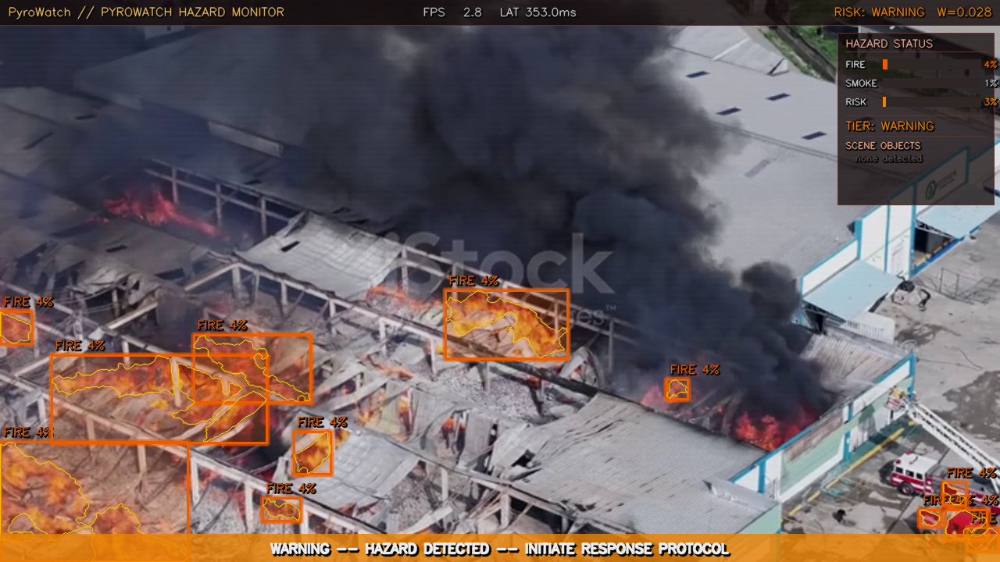
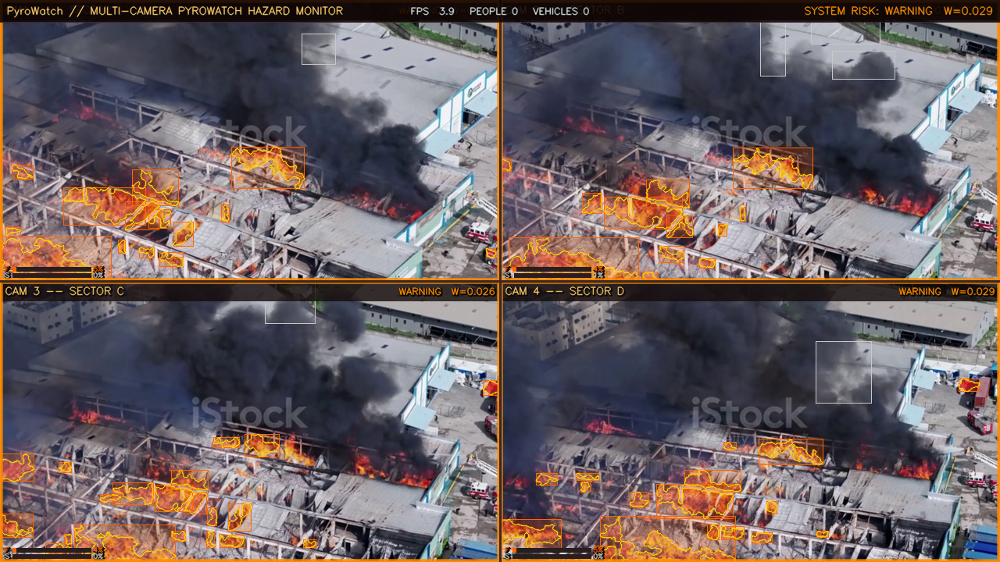

# PyroWatch 🔥

> **Real-time industrial fire & smoke detection system powered by computer vision and deep learning**


PyroWatch is a production-grade computer vision pipeline for real-time hazard monitoring in safety-critical environments such as factories, warehouses, and industrial facilities. It detects fire and smoke from live video feeds, classifies risk severity, renders a cinematic HUD overlay, logs every alert event, sends email notifications, and supports simultaneous monitoring of multiple camera feeds.

---

## Demo




---

## Features

| Feature | Details |
|---------|---------|
| **Fire Detection** | HSV colour segmentation (3 ranges) + morphological cleanup + brightness validation |
| **Smoke Detection** | MOG2 background subtraction + grey-tone HSV mask (handles dark industrial smoke) |
| **Scene Detection** | YOLOv8n detects people, cars, buses, trucks in the hazard zone |
| **Risk Engine** | Weighted scoring → CLEAR / CAUTION / WARNING / CRITICAL tiers |
| **Cyberpunk HUD** | Alpha-blended overlays, neon glow boxes, telemetry bar, animated danger banner, CRT scanlines |
| **Alert Logging** | CSV audit trail of every risk tier change with full telemetry |
| **Email Alerts** | Gmail SMTP notifications with live screenshot attachment on CRITICAL |
| **Multi-Camera** | 2×2 grid of 4 independent feeds, each with its own detectors and HUD |
| **Custom YOLO** | Full training pipeline on 1,800+ annotated fire/smoke images |

---

## System Architecture
Live Video Frame

│

├── FireDetector     HSV segmentation + morphology pipeline

├── SmokeDetector    MOG2 temporal analysis + grey-tone mask

└── SceneDetector    YOLOv8n object detection

│

▼

classify_risk()  ──►  CLEAR / CAUTION / WARNING / CRITICAL

│

▼

HUDRenderer  ──►  composited canvas output

│

┌────────┴─────────┐

│                  │

AlertLogger         AlertMailer

(CSV log)         (Gmail + screenshot)
## Project Structure
pyrowatch/

├── ifsd/                          # Core package

│   ├── config.py                  # Global config (all hyperparameters)

│   ├── utils.py                   # FPSCounter + ExpSmooth (EMA)

│   ├── detectors/

│   │   ├── fire.py                # HSV fire detection pipeline

│   │   ├── smoke.py               # MOG2 smoke detection pipeline

│   │   └── yolo_fire/

│   │       └── detector.py        # Custom trained YOLO detector

│   ├── analytics/

│   │   ├── scene.py               # YOLOv8 scene detector wrapper

│   │   ├── risk.py                # Risk classification engine
│   │   ├── logger.py              # CSV alert logger

│   │   └── alerter.py             # Gmail email alerter

│   └── rendering/

│       ├── hud.py                 # Single-camera HUD renderer

│       └── grid.py                # Multi-camera 2x2 grid renderer

├── training/

│   ├── download_dataset.py        # Downloads fire/smoke dataset

│   ├── train_fast.py              # Trains YOLOv8n (15 epochs, CPU optimised)

│   ├── evaluate.py                # mAP evaluation on test set

│   └── deploy_fast.py             # Deploys weights into package

├── tests/                         # 41 tests across 9 files (all passing)

├── main.py                        # CLI entry point (argparse)

├── run.py                         # Single-camera runner

└── run_multicam.py                # 4-camera grid runner
---

## Quick Start

```bash
# 1. Clone
git clone https://github.com/YOUR_USERNAME/pyrowatch.git
cd pyrowatch

# 2. Install dependencies
pip install opencv-python numpy torch torchvision ultralytics roboflow

# 3. Configure credentials
cp .env.example .env
# Edit .env with your Gmail App Password and Roboflow API key

# 4. Run on a video file
python run.py

# 5. Run multi-camera grid
python run_multicam.py
```

---

## Configuration

Create a `.env` file in the project root:

```env
IFSD_EMAIL_SENDER=your@gmail.com
IFSD_EMAIL_PASSWORD=your_16_char_app_password
IFSD_EMAIL_RECEIVER=alert_recipient@gmail.com
ROBOFLOW_API_KEY=your_roboflow_api_key
```

---

## Controls

| Key | Action |
|-----|--------|
| `Q` | Quit |
| `P` | Pause / Resume |
| `S` | Save screenshot |

---

## Risk Classification
Weighted score:  W = 0.60 × fire_confidence + 0.40 × smoke_confidence
W < 0.005   →  CLEAR     Normal operations

W ≥ 0.005   →  CAUTION   Monitor closely

W ≥ 0.020   →  WARNING   Prepare response team

W ≥ 0.060   →  CRITICAL  Evacuate / call emergency services

---

## Custom YOLO Training

Train a dedicated fire/smoke neural network from scratch:

```bash
python training/download_dataset.py   # Download 1,818 annotated images
python training/train_fast.py         # Fine-tune YOLOv8n (2-3 hrs on CPU)
python training/evaluate.py           # Check mAP50 score
python training/deploy_fast.py        # Deploy into production
```

Then in `run.py`, swap one import line:
```python
from ifsd.detectors.yolo_fire.detector import YOLOFireDetector as FireDetector
```

---

## Test Suite

```bash
python tests/test_step1.py     # Config + telemetry        (3 tests)
python tests/test_step2.py     # Fire detector             (6 tests)
python tests/test_step3.py     # Smoke detector            (7 tests)
python tests/test_step4.py     # Scene detector + risk     (10 tests)
python tests/test_step5.py     # HUD renderer              (9 tests)
python tests/test_step6.py     # Main pipeline             (6 tests)
python tests/test_logger.py    # Alert logger              (8 tests)
python tests/test_alerter.py   # Email alerter             (8 tests)
python tests/test_multicam.py  # Multi-camera grid         (8 tests)
```

**41 tests. All passing.**

---

## Tech Stack

| Library | Purpose |
|---------|---------|
| [OpenCV](https://opencv.org/) | Video capture, image processing, HUD rendering |
| [Ultralytics YOLOv8](https://ultralytics.com/) | Object detection + custom training |
| [NumPy](https://numpy.org/) | Array operations and mask computation |
| [PyTorch](https://pytorch.org/) | Deep learning backend |
| [Roboflow](https://roboflow.com/) | Dataset download and management |

---

## License

MIT License — free to use, modify, and distribute.

---

## Author

Built with Python, OpenCV, and YOLOv8.
